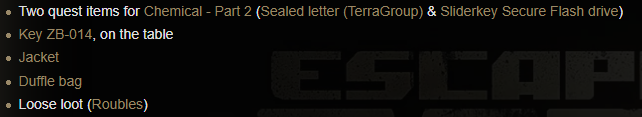

# Key-Grabber
A simple program to parse data from the [wiki](https://escapefromtarkov.fandom.com/wiki/Escape_from_Tarkov_Wiki) into a JSON file to be used in other applications

### Wiki Preview


### JSON Preview *uses item id as object name*
```json
{
    "5780cfa52459777dfb276eb1": [
        "Two quest items for [Chemical - Part 2](https://escapefromtarkov.fandom.com/wiki/Chemical_-_Part_2) ([Sealed letter (TerraGroup)](https://escapefromtarkov.fandom.com/wiki/Sealed_letter_(TerraGroup)) & [Sliderkey Secure Flash drive](https://escapefromtarkov.fandom.com/wiki/Sliderkey_Secure_Flash_drive))",
        "[Key ZB-014](https://escapefromtarkov.fandom.com/wiki/Key_ZB-014), on the table",
        "[Jacket](https://escapefromtarkov.fandom.com/wiki/Jacket)",
        "[Duffle bag](https://escapefromtarkov.fandom.com/wiki/Duffle_bag)",
        "Loose loot ([Roubles](https://escapefromtarkov.fandom.com/wiki/Roubles))"
    ],
```

### Markdown Preview
- Two quest items for [Chemical - Part 2](https://escapefromtarkov.fandom.com/wiki/Chemical_-_Part_2) ([Sealed letter (TerraGroup)](https://escapefromtarkov.fandom.com/wiki/Sealed_letter_(TerraGroup)) & [Sliderkey Secure Flash drive](https://escapefromtarkov.fandom.com/wiki/Sliderkey_Secure_Flash_drive))
 - [Key ZB-014](https://escapefromtarkov.fandom.com/wiki/Key_ZB-014), on the table
 - [Jacket](https://escapefromtarkov.fandom.com/wiki/Jacket)
 - [Duffle bag](https://escapefromtarkov.fandom.com/wiki/Duffle_bag)
 - Loose loot ([Roubles](https://escapefromtarkov.fandom.com/wiki/Roubles))
